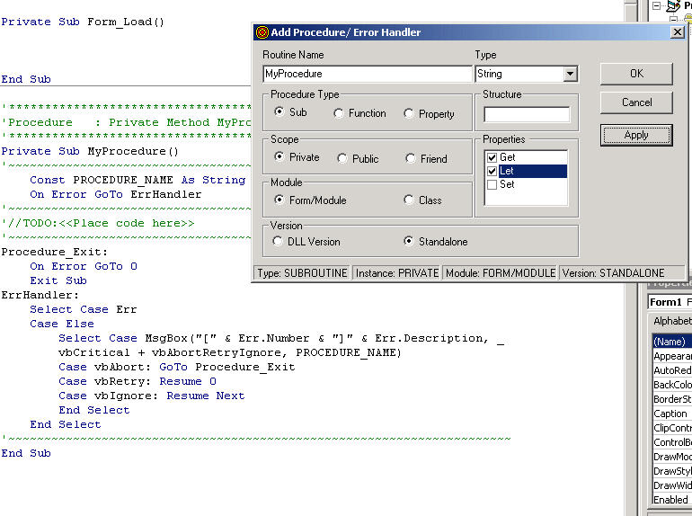



## AddProcedure

### Description

This is a addin that I wrote while working on a major project that needed many classes and repeated code. It will insert a sub, function and property with error handling. You can select private or public. If it is a class or a form. You can create a user defined type in a class, select it and it will create the properties for it. Give it a try.
 
### More Info
 

             |
---                |---
**Submitted On**   |2004-12-22 11:18:36
**By**             |[Gary Simonelli](https://github.com/Planet-Source-Code/PSCIndex/blob/master/ByAuthor/gary-simonelli.md)
**Level**          |Intermediate
**User Rating**    |4.8 (24 globes from 5 users)
**Compatibility**  |VB 6\.0
**Category**       |[Debugging and Error Handling](https://github.com/Planet-Source-Code/PSCIndex/blob/master/ByCategory/debugging-and-error-handling__1-26.md)
**World**          |[Visual Basic](https://github.com/Planet-Source-Code/PSCIndex/blob/master/ByWorld/visual-basic.md)
**Archive File**   |[AddProcedu1853632162005\.zip](https://github.com/Planet-Source-Code/gary-simonelli-addprocedure__1-58950/archive/master.zip)

